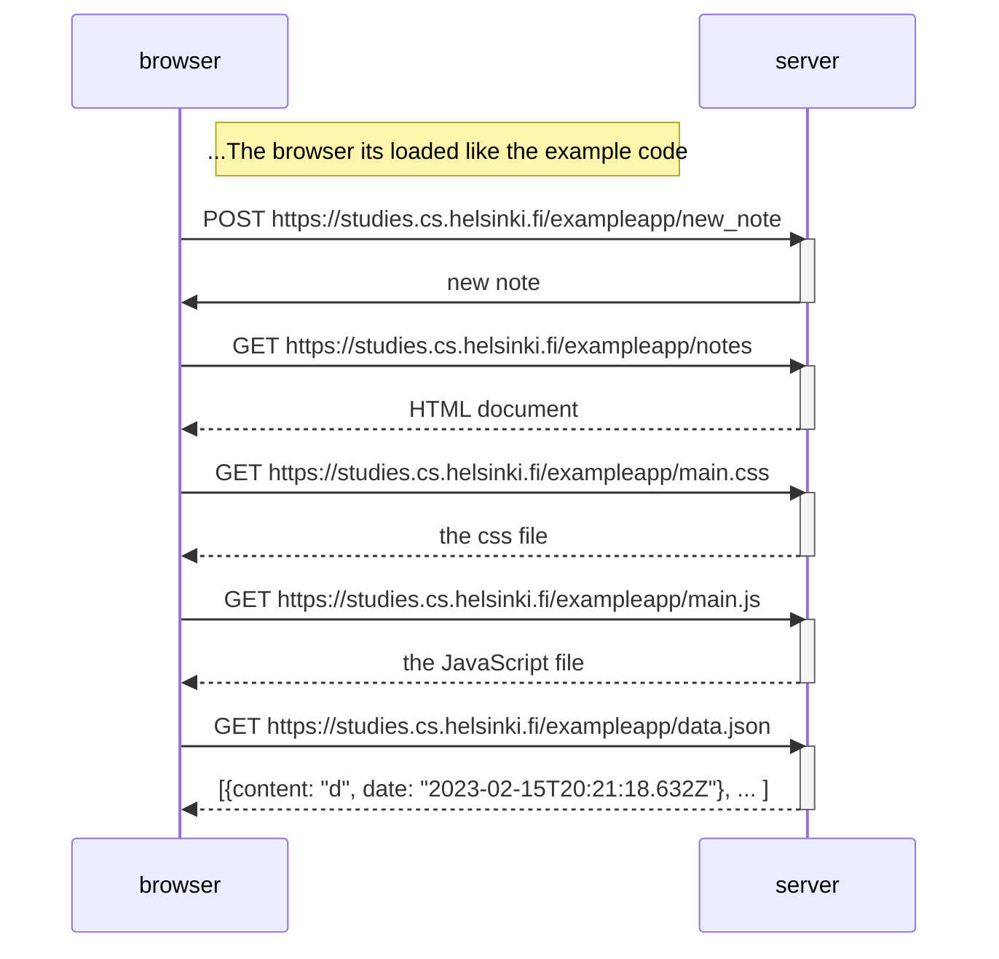

```mermaid
sequenceDiagram
  participant browser
  participant server
  Note right of browser: ...The browser its loaded like the example code
  browser->>server: POST https://studies.cs.helsinki.fi/exampleapp/new_note
  activate server
  server->>browser: new note
  deactivate server
  
  browser->>server: GET https://studies.cs.helsinki.fi/exampleapp/notes
  activate server
  server-->>browser: HTML document
  deactivate server

  browser->>server: GET https://studies.cs.helsinki.fi/exampleapp/main.css
  activate server
  server-->>browser: the css file
  deactivate server
    
  browser->>server: GET https://studies.cs.helsinki.fi/exampleapp/main.js
  activate server
  server-->>browser: the JavaScript file
  deactivate server
  
  browser->>server: GET https://studies.cs.helsinki.fi/exampleapp/data.json
  activate server
  server-->>browser: [{content: "d", date: "2023-02-15T20:21:18.632Z"}, ... ]
  deactivate server    
```
